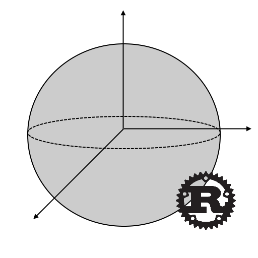

## Synopsis



A Rust crate use for performing coordinate transformations. The crate relies on nalgebra vectors to perform the coordinate transformations.

[](https://travis-ci.org/DaveKram/coord_transforms)

<br>

## Code Example

```
let ellipsoid = geo_ellipsoid::geo_ellipsoid::new(geo_ellipsoid::WGS84_SEMI_MAJOR_AXIS_METERS, 
                                                    geo_ellipsoid::WGS84_FLATTENING);
let lla_vec: Vector3<f64> = Vector3::new(3.0, 4.0, 5.0);
let ecef_vec = lla2ecef(&lla_vec, &ellipsoid);
assert_approx_eq!(ecef_vec.x, 4127585.379918784);
assert_approx_eq!(ecef_vec.y, 4779006.1975849345);
assert_approx_eq!(ecef_vec.z, 894117.5572814466);
```

## Features

* Simple, one line function calls to convert from one coordinate system to another
* Common geodetic models provided for geodetic coordinate transformations
* Uses nalgebra (widely used linear algebra crate)

## Tests

The crate has unit tests built in. If you want to verify this yourself, run:

```
cargo test
```

## Examples

There are very early work in progress examples being built. These contain basic examples, benchmarking, and other types of examples to help aid in use of the crate. To run an example from the /examples directory:

```
cargo run --example <FILE_NAME_HERE>
```

## License

Copyright (c) 2017 David Kramer

Permission is hereby granted, free of charge, to any person obtaining a copy of this software and associated documentation files (the "Software"), to deal in the Software without restriction, including without limitation the rights to use, copy, modify, merge, publish, distribute, sublicense, and/or sell copies of the Software, and to permit persons to whom the Software is furnished to do so, subject to the following conditions:

The above copyright notice and this permission notice shall be included in all copies or substantial portions of the Software.

THE SOFTWARE IS PROVIDED "AS IS", WITHOUT WARRANTY OF ANY KIND, EXPRESS OR IMPLIED, INCLUDING BUT NOT LIMITED TO THE WARRANTIES OF MERCHANTABILITY, FITNESS FOR A PARTICULAR PURPOSE AND NONINFRINGEMENT. IN NO EVENT SHALL THE AUTHORS OR COPYRIGHT HOLDERS BE LIABLE FOR ANY CLAIM, DAMAGES OR OTHER LIABILITY, WHETHER IN AN ACTION OF CONTRACT, TORT OR OTHERWISE, ARISING FROM, OUT OF OR IN CONNECTION WITH THE SOFTWARE OR THE USE OR OTHER DEALINGS IN THE SOFTWARE.
